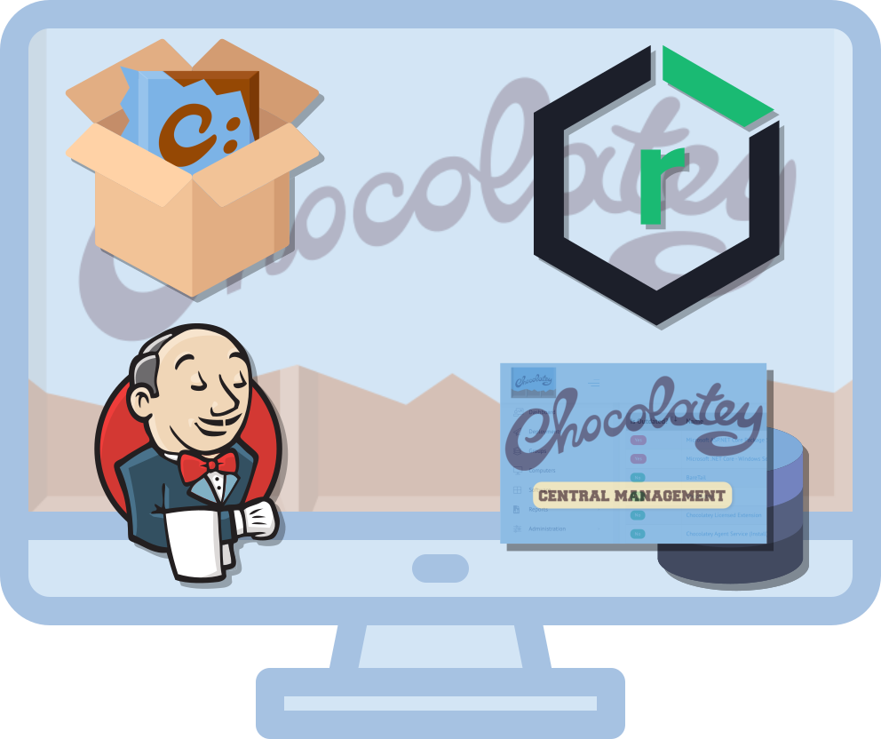

# C4B Quick-Start Guide - Supporting Scripts

This repository contains a set of supporting scripts used for the Chocolatey for Business (C4B) Quick-Start Guide (QSG).

These scripts can be used to assist in setup of a brand new Windows Server as a C4B Server.

Below is the planned revision of the QSG, which will evntually be posted in the [Chocolatey Docs](https//docs.chooclatey.org).

## Chocolatey for Business (C4B) Quick-Start Guide

Thank you for choosing Chocolatey as your partner in Windows software automation management. We are excited to help you dive in and successfully implement a deployment of all the necessary components.

> :memo: **NOTE**
>
> This quick-start guide is intended for customers who have recently purchased Chocolatey for Business (C4B), or are evaluating C4B as part of a proof-of-concept.
> It illustrates only **one** method of setting up your Chocolatey environment, and is by **NO** means exhaustive.
> Our goal is to get you up-and-running quickly, and testing out the feature set.
> For a more complete reference of possible scenarios and solutions, please refer to the [Organizational Deployment Documentation](xref:organizational-deployment-guide).

If you have any questions or would like to discuss more involved implementations, please feel free to reach out to your Chocolatey representative.

Let's get started!

## Components



Chocolatey For Business installation

1. **C4B Licensed components**: A licensed version of Chocolatey includes:
    * Installation of the Chocolatey OSS client package itself (`chocolatey`)
    * Chocolatey license file (`chocolatey.license.xml`) installed in the correct directory (`ProgramData\chocolatey\license`)
    a. Installation of the Chocolatey Licensed extension (`chocolatey.extension`), giving you access to features like Package Bulder, Package Internalizer, etc. (full list [here](https://docs.chocolatey.org/en-us/features/)).
    <p></p>

1. **NuGet V2 Repository Server App**: Chocolatey works best with a NuGet V2 repository. This application hosts and manages versioning of your Chocolatey package artifacts, in their enhanced NuGet package (.nupkg) file format. This guide will help you setup [Sonatype Nexus Repository Manager (OSS)](https://www.sonatype.com/nexus-repository-oss).

1. **Chocolatey Central Management (CCM) Server App**: CCM is the Web UI portal for your entire Chocolatey environment. Your endpoints check-in to CCM to report their package status. This includes the Chocolatey packages they have installed, and whther any of these packages are outdated. And now, with CCM Deployments, you can also deploy packages or package updates to groups of endpoints, as well as ad-hoc PowerShell commands. CCM is backed by an MS SQL Database. This guide will set up MS SQL Express for you.

1. **Automation Pipeline**: A piepline tool will help you automate repetitive tasks, such checking for updates to a set of Chocolatey Packages from the Chocolatey Community Repository (CCR). If updates exist, the pipeline task will auto-internalize your list of packages, and push them into your NuGet repository for you. This guide will help you set up Jenkins as your automation pieline tool.

## Requirements

Below are the minimum requirements for setting up your C4B server via this guide:
- Windows Server 2019+ (ideally, Windows Server 2019)
    - Windows Server 2016 is technically supported, but not recommended as it is nearing End-of-Life; also, you will require an additional setup script.
- 4+ CPU cores (more preferred)
- 16 GB+ RAM (8GB as a bare minimum; 4GB of RAM is reserved specifically for Nexus)
- 500 GB+ of free space for local NuGet package artifact storage (more is better, and you may have to grow this as your packages and versions increase)
- Open outgoing (egress) Internet access
- Administrator user rights

> :exclamation:**[IMPORTANT]** All commands should be run from an Administrator PowerShell window (and **not ISE**)

### Step 0: Preparation of C4B Server

1. Provision your C4B server on the infrastructure of your choice.

1. Install all Windows Updates.

1. If you plan on joining your domain, do so now before beginning setup below.

1. If you plan to use a Purchased/Acquired or Domain SSL certificate, please ensure the CN/Subject value matches the DNS-resolvable Fully-Qualified Domain Name (FQDN) of your C4B Server. Place this certificate in the `Local Machine > Personal` certificate store, and ensure that the private key is exportable.

1. Copy your `chocolatey.license.xml` license file (from the email you received) onto your C4B Server.


### Step 1: Begin C4B Setup

1. Open a PowerShell console with the `Run as Administrator` option, and paste and run the following code:

```powershell
Set-ExecutionPolicy Bypass -Scope Process -Force
[Net.ServicePointManager]::SecurityProtocol = [Net.SecurityProtocolType]::tls12
$QuickStart = 'https://raw.githubusercontent.com/chocolatey/choco-quickstart-scripts/main/Start-C4BSetup.ps1'
Invoke-Expression -Command ((New-Object System.Net.WebClient).DownloadString($QuickStart))
```

> :scroll: **What does this script do?**
> - Install of Chocolatey from https://chocolatey.org
> - Prompt for your C4B license file location, with validation
> - Script to help turn your C4B license into a Chocolatey package
> - Setup of local `choco-setup` directories
> - Download of setup files from "choco-quickstart-scripts" GitHub repo
> - Download of Chocolatey packages required for setup
> - Output data to JSON to pass between scripts

### Step 2: Nexus Setup

1. In the same PowerShell Administrator console as above, paste and run the following code:

```powershell
Set-Location "$env:SystemDrive\choco-setup\files"
.\Start-C4BNexusSetup.ps1
```

> :scroll: **What does this script do?**
> - Installs Sonatype Nexus Repository Manager OSS instance
> - Edits configuration to allow running of scripts
> - Cleans up all demo repositories on Nexus
> - Creates a `ChocolateyInternal` NuGet repository
> - Creates a `ChocolateyTest` NuGet repository
> - Creates a `choco-install` raw repository
> - Setup of `ChocolateyInternal` on C4B Server as source, with API key
> - Setup of firewall rule for repository access
> - Installs MS Edge, and disable first-run experience
> - Outputs data to JSON to pass between scripts

### Step 3: CCM Setup

1. In the same PowerShell Administrator console as above, paste and run the following code:

```powershell
Set-Location "$env:SystemDrive\choco-setup\files"
.\Start-C4bCcmSetup.ps1
```

> :scroll: **What does this script do?**
> - Install of MS SQL Express
> - Creation and permissions of `ChocolateyManagement` database
> - Install of all 3 CCM packages, with correct parameters
> - Output data to JSON to pass between scripts

### Step 4: SSL Setup

1. In the same PowerShell Administrator console as above, paste and run the following code:

```powershell
Set-Location "$env:SystemDrive\choco-setup\files"
.\Set-SslSecurity.ps1
```

> :scroll: **What does this script do?**
> - Adds SSL certificate configuration for Nexus and CCM Web
> - Outputs data to JSON to pass between scripts
> - Generates a `Register-C4bEndpoint.ps1` script for you to easily set up endpoint clients

### Step 5: Jenkins Setup

1. In the same PowerShell Administrator console as above, paste and run the following code:

```powershell
Set-Location "$env:SystemDrive\choco-setup\files"
.\Start-C4bJenkinsSetup.ps1
```

> :scroll: **What does this script do?**
> - Installs Jenkins package (pinned to a specific version)
> - Updates Jenkins plugins
> - Configures pre-downloaded Jenkins scripts for Package Internalizer automation
> - Sets up pre-defined Jenkins jobs for the scripts above
> - Outputs data to JSON to pass between scripts
> - Auto-opens web portals for CCM, Nexus, and Jenkins in your broswer


### Step 6: Setting up Endpoints

1. Find the `Register-C4bEndpoint.ps1` script in the `choco-setup\files\scripts\` directory on your C4B Server. Copy this script to your client endpoint.

1. Open a PowerShell Administrator console on your client endpoint, and browse (`cd`) to the location you copied the script above. Paste and run the following code:

```powershell
Set-ExecutionPolicy Bypass -Scope Process -Force
[Net.ServicePointManager]::SecurityProtocol = [Net.SecurityProtocolType]::tls12
.\Register-C4bEndpoint.ps1
```

> :scroll: **What does this script do?**
> - Installs Chocolatey client (`chocolatey`), using a script from your raw "`choco-install`" repository
> - Runs the `ClientSetup.ps1` script from your raw "`choco-install`" repository, which does the following:
>   - Licenses Chocolatey by installing the license package (`chocolatey-license`) created during QDE setup
>   - Installs the Chocolatey Licensed Extension (`chocolatey.extension`) without context menus
>   - Installs the Chocolatey Agent service (`chocolatey-agent`)
>   - Configures ChocolateyInternal source
>   - Disables access to the public Chocolatey Community Repository (CCR)
>   - Configures Self-Service mode and installs Chocolatey GUI (`chocolateygui`)
>   - Configures Central Management (CCM) check-in, and opts endpoints into CCM Deployments
